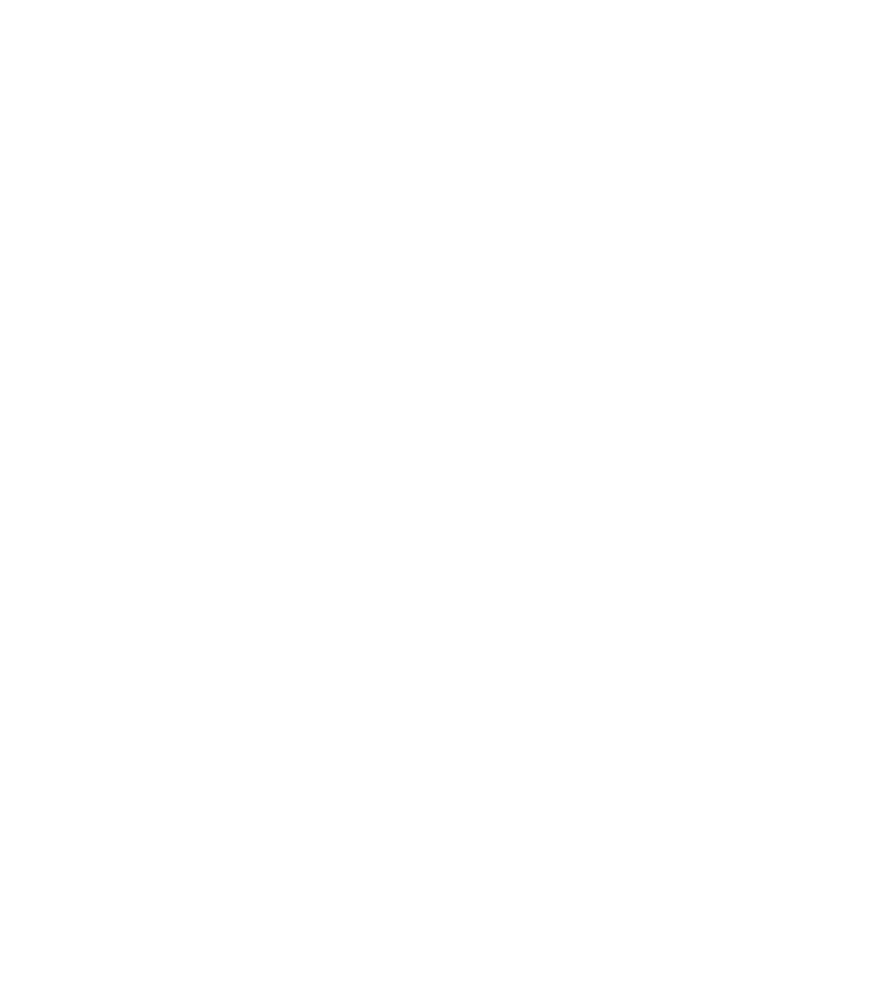

# micrograd.c

A C implementation of Karpathy's [micrograd](https://github.com/karpathy/micrograd): a scalar-valued autograd engine and a neural net library.

## Test it
To run the test, use the following commands:
```
make
./micrograd
```

## Computational graph visuals
`test.c` contains four data points. Therefore, we generate one `.dot` file per data point at the end of the training loop. To visualize it as a `png`, run the following command:

`dot -Tpng graph0.dot -o graph0.png`



## To-dos
- [x] add layers
- [x] add MLP
- [x] loss fn & gradient descent optimization
- [x] add more non-linear fns
- [x] add graph fns
- [ ] generalize pow fn
- [ ] rewrite to make it less disgusting
